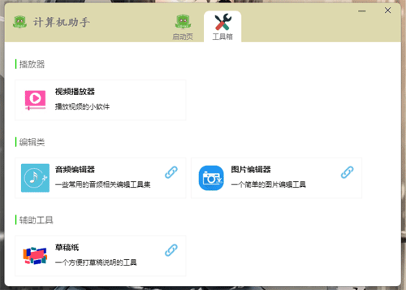

# Computer Helper
计算机助手

## Issues
使用的时候遇到任何问题或有好的建议，请点击进入[issue](https://github.com/hai2007/computer-helper/issues)，欢迎参与维护！

## 如何启动开发？

我们有两个程序需要分别启动，首先是web进程：

```bash
npm run dev-web
```

只有在web进程启动成功以后才应该执行下面的命令以启动主进程：

```bash
npm run dev-win
```

当然，上面是windows下的命令，如果你是mac电脑请使用：

```bash
npm run dev-mac
```

## 如何调试主进程？

首先进入项目，运行：

```bash
npm run debug-win
```

上面是windows电脑，如果是mac电脑请使用：

```bash
npm run debug-mac
```

当然,你应该在调试的地方提前添加“ debugger ”语句，这和普通的web端调试一样，接着，在chrome浏览器地址栏中输入：

```
chrome://inspect/#devices
```

然后点击“ Open dedicated DevTools for Node ”后进入调试界面即可。

## 如何打包成exe或dmg等最终软件或安装包？

如果你是windows请执行：

```bash
npm run build-win
```

相应的mac电脑请执行：

```bash
npm run build-mac
```

## icns 制作教程

> Mac电脑上操作

桌面创建个文件夹，命名如：```icon```，我们就在这个文件夹里面进行操作。

把源文件，拖进这个文件夹，命名为```pic.png```，同时，在此文件夹中创建一个文件夹```tmp.iconset```，然后，在icon目录下执行下面命令：

```
sips -z 16 16     pic.png --out tmp.iconset/icon_16x16.png
sips -z 32 32     pic.png --out tmp.iconset/icon_16x16@2x.png
sips -z 32 32     pic.png --out tmp.iconset/icon_32x32.png
sips -z 64 64     pic.png --out tmp.iconset/icon_32x32@2x.png
sips -z 128 128   pic.png --out tmp.iconset/icon_128x128.png
sips -z 256 256   pic.png --out tmp.iconset/icon_128x128@2x.png
sips -z 256 256   pic.png --out tmp.iconset/icon_256x256.png
sips -z 512 512   pic.png --out tmp.iconset/icon_256x256@2x.png
sips -z 512 512   pic.png --out tmp.iconset/icon_512x512.png
sips -z 1024 1024   pic.png --out tmp.iconset/icon_512x512@2x.png
```

执行完毕后，再用下面的命令即可生成icns文件:

```
iconutil -c icns tmp.iconset -o Icon.icns
```

开源协议
---------------------------------------
[MIT](https://github.com/hai2007/computer-helper/blob/master/LICENSE)

Copyright (c) 2022 [hai2007](https://hai2007.github.io/SweetHome/) 走一步，再走一步。
